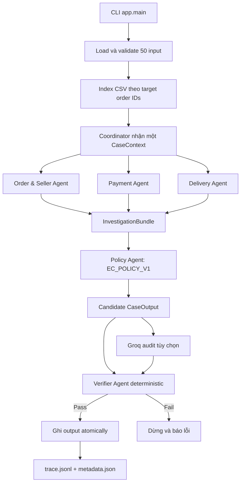

# Tài liệu tổng hợp: Code, kiến trúc và chu trình dữ liệu

## 1. Mục đích hệ thống

Hệ thống xử lý 50 yêu cầu hỗ trợ thương mại điện tử trên dữ liệu Olist. Mỗi input cung cấp
`case_id`, nội dung khiếu nại, `claimed_order_id` và phiên bản policy. Chương trình dùng
`claimed_order_id` để truy xuất dữ liệu thật, phân tích qua nhiều agent, áp dụng
`EC_POLICY_V1`, kiểm tra kết quả và ghi một JSON tương ứng vào `output/`.

Nguyên tắc quan trọng nhất:

- CSV và policy deterministic là nguồn quyết định cuối cùng.
- LLM chỉ audit kết luận, không được sửa issue, evidence, số tiền hoặc action.
- Mọi evidence ID phải trỏ tới một row có thật hoặc một policy code hợp lệ.
- Mọi phép tính tiền dùng `Decimal` và làm tròn hai chữ số.

## 2. Cấu trúc source code

| Thành phần | Vai trò |
| --- | --- |
| [`app/main.py`](app/main.py) | CLI, đọc cờ `--llm-audit` và khởi động pipeline |
| [`app/config.py`](app/config.py) | Đường dẫn, model, confidence, tolerance và cách đọc API key |
| [`app/contracts.py`](app/contracts.py) | Schema Pydantic cho input, handoff và output |
| [`app/data_repository.py`](app/data_repository.py) | Đọc/index CSV và dựng `CaseContext` |
| [`app/agents.py`](app/agents.py) | Order/Seller, Payment, Delivery, Policy và Verifier Agent |
| [`app/policy.py`](app/policy.py) | Sáu rule của `EC_POLICY_V1` theo thứ tự ưu tiên |
| [`app/llm_audit.py`](app/llm_audit.py) | Groq audit không có quyền thay đổi output |
| [`app/pipeline.py`](app/pipeline.py) | Coordinator, handoff, trace, verify và ghi output |
| [`app/trace.py`](app/trace.py) | Ghi trace JSONL có khóa theo từng event |
| [`scripts/validate_outputs.py`](scripts/validate_outputs.py) | Kiểm tra đủ file, schema, policy, evidence và số tiền |
| [`scripts/build_reference_outputs.py`](scripts/build_reference_outputs.py) | Oracle độc lập đọc thẳng CSV để đối chiếu output |
| [`tests/test_pipeline.py`](tests/test_pipeline.py) | Test policy priority, edge case, evidence và 50 output |

Các thư mục dữ liệu/artifact:

- `input/`: 50 case từ `EC_001.json` đến `EC_050.json`.
- `data/`: snapshot Olist.
- `output/`: đúng 50 JSON dùng để nộp.
- `logging/trace.jsonl`: trace của lượt chạy gần nhất.
- `logging/metadata.json`: runtime, model và thống kê LLM audit.

## 3. Luồng tổng thể



Pipeline hiện chạy từng case theo thứ tự tên file. Trong một case, ba agent nghiệp vụ được
Coordinator gọi lần lượt rồi ghép kết quả vào một `InvestigationBundle` có schema rõ ràng.

## 4. Nạp input và dữ liệu

### 4.1. Kiểm tra input

`load_cases()` trong `app/pipeline.py`:

1. Tìm tất cả `input/*.json` và sắp xếp theo tên.
2. Parse bằng `InputCase` của Pydantic.
3. Kiểm tra tên file bằng `case_id`.
4. Không cho trùng `case_id`.
5. Không cho trùng `claimed_order_id` trong batch.

Nếu một điều kiện sai, chương trình dừng thay vì tự đoán.

### 4.2. Index CSV

`DataRepository.load()` chỉ giữ row thuộc 50 target order IDs ở ba bảng lớn:

| Nguồn | Khóa/field được dùng |
| --- | --- |
| `olist_orders_dataset.csv` | `order_id`, status, carrier date, customer date, estimated date |
| `olist_order_items_dataset.csv` | `order_id`, item ID, seller ID, shipping limit, price, freight |
| `olist_order_payments_dataset.csv` | `order_id`, payment sequential, payment value |
| `olist_sellers_dataset.csv` | Toàn bộ seller ID hợp lệ để verifier kiểm tra tồn tại |

Các row item được sắp theo `order_item_id`; payment được sắp theo `payment_sequential`.
Repository sau đó dựng một `CaseContext` bất biến cho từng case.

### 4.3. Các giá trị suy ra trong `CaseContext`

```text
item_total       = tổng price của mọi item row
freight_total    = tổng freight_value của mọi item row
payment_total    = tổng payment_value của mọi payment row
payment_difference = |payment_total - item_total - freight_total|
```

Một seller bị coi là bàn giao muộn nếu:

```text
order_delivered_carrier_date > shipping_limit_date của item thuộc seller đó
```

Một order giao trễ nếu:

```text
order_delivered_customer_date > order_estimated_delivery_date
```

## 5. Vai trò và handoff của từng agent

### 5.1. Coordinator Agent

Nằm trong `MultiAgentPipeline`. Agent này không tự quyết định policy mà:

- Nhận case và `CaseContext`.
- Giao việc cho ba agent domain.
- Ghép ba fact packet thành `InvestigationBundle`.
- Chuyển bundle cho Policy Agent.
- Gửi candidate qua LLM audit và Verifier Agent.
- Chỉ ghi file khi verifier không trả lỗi.

### 5.2. Order & Seller Agent

Trả `OrderFacts`:

- `order_id`
- `order_status`
- toàn bộ `item_ids`
- toàn bộ `seller_ids`
- `late_seller_ids`

Agent này chịu trách nhiệm xác định seller nào vi phạm shipping limit.

### 5.3. Payment Agent

Trả `PaymentFacts`:

- toàn bộ `payment_ids`
- item total
- freight total
- payment total
- chênh lệch đối soát
- cờ `reconciled`, đúng khi chênh lệch không quá `0.10 BRL`

Không nhân `payment_value` với số installment vì mỗi payment row đã là giá trị giao dịch.

### 5.4. Delivery Agent

Trả `DeliveryFacts`:

- có giao đến khách hay không
- giao sau estimated date hay không
- có carrier handoff timestamp hay không

### 5.5. Policy Agent

Nhận `InvestigationBundle`, xác nhận bundle thuộc đúng case rồi áp dụng rule deterministic.
Agent dựng toàn bộ `CaseOutput`, gồm assessment, entity, root cause, evidence, tài chính và
resolution action.

### 5.6. Verifier Agent

Verifier tính lại policy từ `CaseContext` và kiểm tra độc lập:

- `case_id`, primary issue và case status.
- Bốn trường tài chính.
- Evidence có tồn tại và đúng tập liên quan.
- Policy evidence bắt buộc.
- Resolution action đúng.
- Edge case order không có item.
- Seller ID tồn tại trong seller dataset.

Candidate bị từ chối nếu chỉ một kiểm tra sai.

## 6. Policy priority

Rule được duyệt từ trên xuống; rule đầu tiên match sẽ thắng.

| Priority | Primary issue | Điều kiện chính | Party | Refund | Action |
| ---: | --- | --- | --- | ---: | --- |
| 1 | `canceled_order_paid` | canceled và payment > 0 | platform | payment total | `issue_full_refund` |
| 2 | `unavailable_order_paid` | unavailable và payment > 0 | platform | payment total | `issue_full_refund` |
| 3 | `late_delivery_seller` | giao trễ và có late seller | seller vi phạm | freight total | `refund_freight` |
| 4 | `late_delivery_logistics` | giao trễ, có item/handoff, không late seller | logistics | freight total | `refund_freight` |
| 5 | `valid_split_payment` | từ hai payment row và reconciled | không có | 0 | `explain_valid_split_payment` |
| 6 | `unsupported_late_claim` | giao đúng hạn và reconciled | không có | 0 | `reject_late_refund` |

Thứ tự này xử lý tình huống một case đồng thời có nhiều payment row và giao đúng hạn:
`valid_split_payment` được chọn trước `unsupported_late_claim`.

## 7. Quy tắc evidence đạt chuẩn

Evidence được dựng theo dữ liệu cần chứng minh output:

| Cause | Evidence |
| --- | --- |
| `ORDER_CANCELED_AFTER_PAYMENT` | order + item + payment + policy |
| `ORDER_UNAVAILABLE_AFTER_PAYMENT` | order + payment + policy |
| `SELLER_HANDOFF_AFTER_LIMIT` | order + item + payment + seller chịu trách nhiệm + policy |
| `CARRIER_DELIVERED_AFTER_ESTIMATE` | order + item + payment + policy |
| `MULTIPLE_PAYMENTS_RECONCILED` | order + item + payment + policy |
| `DELIVERY_WITHIN_ESTIMATE` | order + item + payment + policy |

Quy ước ID:

```text
order:<order_id>
item:<order_id>:<order_item_id>
payment:<order_id>:<payment_sequential>
seller:<seller_id>
policy:<root_cause_code>
```

Seller evidence chỉ xuất hiện khi seller thực sự chịu trách nhiệm. Item evidence vẫn được
giữ cho canceled order vì nó chứng minh `item_total_brl` và `freight_total_brl` trong output.

Schema cho tối đa 10 evidence. Hàm `_build_evidence()` dành slot cuối cho policy:

```text
9 source evidence đầu tiên + policy evidence
```

## 8. Chu trình chi tiết của một case: EC_001

### 8.1. Input

```json
{
  "case_id": "EC_001",
  "customer_request": {
    "message": "Tôi cho rằng đơn hàng được giao trễ...",
    "claimed_order_id": "e2a03ccf5ea816036608b2d8c3ab8e60"
  },
  "policy_version": "EC_POLICY_V1"
}
```

### 8.2. Raw rows liên quan

Order row:

| Field | Value |
| --- | --- |
| status | `delivered` |
| delivered carrier date | `2017-12-13 13:45:24` |
| delivered customer date | `2017-12-15 18:56:35` |
| estimated delivery date | `2017-12-12 00:00:00` |

Item row `:1`:

| Field | Value |
| --- | --- |
| seller | `f7496d659ca9fdaf323c0aae84176632` |
| shipping limit | `2017-12-04 11:50:50` |
| price | `119.90` |
| freight | `12.04` |

Payment row `:1` có giá trị `131.94`.

### 8.3. Suy luận domain

Delivery:

```text
2017-12-15 18:56:35 > 2017-12-12 00:00:00
=> delivered_after_estimate = true
```

Seller handoff:

```text
2017-12-13 13:45:24 > 2017-12-04 11:50:50
=> seller f749... bàn giao sau shipping limit
```

Payment reconciliation:

```text
item_total    = 119.90
freight_total = 12.04
expected      = 131.94
payment_total = 131.94
difference    = 0.00
=> reconciled = true
```

### 8.4. Fact packet và policy

Order & Seller Agent trả một late seller. Delivery Agent xác nhận giao trễ. Payment Agent
xác nhận các tổng tiền khớp. Policy duyệt rule theo priority:

1. Không canceled.
2. Không unavailable.
3. Giao trễ và có late seller: match.

Kết luận:

```text
primary_issue = late_delivery_seller
cause          = SELLER_HANDOFF_AFTER_LIMIT
party          = seller/f7496d659ca9fdaf323c0aae84176632
refund         = freight_total = 12.04 BRL
action         = refund_freight
```

### 8.5. Evidence

```json
[
  "order:e2a03ccf5ea816036608b2d8c3ab8e60",
  "item:e2a03ccf5ea816036608b2d8c3ab8e60:1",
  "payment:e2a03ccf5ea816036608b2d8c3ab8e60:1",
  "seller:f7496d659ca9fdaf323c0aae84176632",
  "policy:SELLER_HANDOFF_AFTER_LIMIT"
]
```

### 8.6. LLM audit và verifier

Lượt chạy hiện tại ghi nhận cho EC_001:

- Groq request thành công.
- Model trả `agreed: true`, lý do `Issues match`.
- Verifier trả `passed: true`, không có error.
- Output được ghi vào `output/EC_001.json`.

Toàn batch hiện có 50 attempts, 50 successes và 50 agreements.

## 9. Vai trò thật của LLM

Model cố định trong source là `llama-3.1-8b-instant`, 8B, gọi qua Groq.

Khi không có `--llm-audit`, pipeline vẫn tạo đúng output vì policy hoàn toàn deterministic.
Khi bật cờ này, audit agent:

1. Tính các rule có thể match từ `InvestigationBundle`.
2. Chọn expected issue theo cùng priority.
3. Gửi `selected_issue` và `expected_issue` cho model.
4. Yêu cầu JSON `{agreed, reason}`.
5. Ghi response và token usage vào trace.

Model không được trả một output mới. Dù API lỗi, candidate deterministic không bị sửa;
Verifier vẫn là quality gate cuối.

API key được đọc từ `.env` ở root repo hoặc thư mục cha theo thứ tự:

```text
OPENAI_API_KEY
OPENAI_API_KEY_2
...
OPENAI_API_KEY_7
```

Key sau đóng vai trò failover. Secret không được ghi vào trace hoặc metadata.

## 10. Trace và metadata

`TraceWriter` xóa trace cũ khi bắt đầu lượt chạy mới. Mỗi case hiện có 12 event chính:

1. `case_received`
2. handoff tới Order & Seller Agent
3. kết quả Order & Seller Agent
4. handoff tới Payment Agent
5. kết quả Payment Agent
6. handoff tới Delivery Agent
7. kết quả Delivery Agent
8. handoff tới Policy Agent
9. kết quả Policy Agent
10. `model_audit`
11. `verification`
12. `output_written`

`metadata.json` ghi:

- run ID và thời gian.
- số case và phân bố issue.
- provider/model/parameter size.
- trạng thái, token usage và agreement của LLM audit.
- Python/runtime/framework.
- danh sách agent.

Lượt chạy gần nhất có 600 trace rows, tương ứng 50 case x 12 event.

## 11. Ghi output an toàn

Trước batch, pipeline xóa các JSON output cũ. Mỗi output mới được ghi theo cách atomic:

1. Ghi vào `<case>.json.tmp`.
2. Validate đã hoàn tất trước đó.
3. Rename/replace thành `<case>.json`.

Nếu process bị ngắt giữa batch, thư mục có thể chỉ chứa một phần file. Vì vậy luôn chạy
validator trước khi nộp.

## 12. Kiểm thử và chạy chương trình

Cài dependency:

```powershell
python -m pip install -e ".[test]"
```

Chạy không dùng LLM:

```powershell
python -m app.main
```

Chạy có Groq audit:

```powershell
python -m app.main --llm-audit
```

Chạy test và validator:

```powershell
python -m pytest
python -m scripts.validate_outputs
python -m scripts.build_reference_outputs --compare output
```

Các test quan trọng:

- Đủ 50 input và đúng phân bố sáu issue.
- Rule priority cho 9 case overlap.
- Tám unavailable order không có item vẫn được refund đúng payment total.
- Output generated khớp oracle độc lập.
- Evidence type đúng theo từng cause.

## 13. Edge cases đã xử lý

### Unavailable order không có item

- `item_ids` và `seller_ids` rỗng.
- item/freight total bằng 0.
- payment vẫn có và full refund bằng payment total.

### Nhiều item

- Cộng tất cả price và freight bằng `Decimal`.
- Giữ từng item ID trong entity/evidence theo giới hạn schema.
- Seller vi phạm được suy ra theo từng shipping limit.

### Nhiều payment row

- Cộng tất cả payment value.
- Không nhân installment.
- Giữ từng `payment_sequential` làm evidence.

### Rule overlap

- Ordered registry đảm bảo split payment thắng unsupported late claim khi cả hai cùng đúng.

### Evidence false positive

- Seller evidence chỉ thêm khi seller là responsible party.
- Policy evidence luôn được giữ ở slot cuối.
- Verifier so tập evidence thực tế với tập expected.

## 14. Mở rộng hệ thống

Để thêm policy version mới mà không hard-code case ID:

1. Thêm ordered rules vào `POLICY_RULES` theo version.
2. Thêm evidence mapping cho cause mới.
3. Nếu cần field mới, mở rộng Pydantic contracts.
4. Mở rộng verifier để tính lại expected value.
5. Thêm test cho rule priority và edge case.

Không nên dùng nội dung message để đoán output nếu CSV đã có fact kiểm chứng. Message chỉ mô tả
khiếu nại; quyết định phải đến từ dữ liệu và policy.

## 15. Checklist trước khi nộp

- [ ] `python -m pytest` pass.
- [ ] `python -m scripts.validate_outputs` báo 50 output.
- [ ] `output/` chỉ có `EC_001.json` đến `EC_050.json`.
- [ ] Không có `.gitkeep`, zip cũ hoặc file log trong `output/`.
- [ ] `logging/trace.jsonl` và `logging/metadata.json` là lượt chạy mới nhất.
- [ ] Không commit `.env` hoặc API key.
- [ ] Commit/push source trước khi nộp.
- [ ] Khi nén thủ công, archive phải có lớp ngoài `output/`.

## 16. Tóm tắt một câu

Mỗi case đi từ input ID sang các row Olist đã index, qua ba agent tạo fact packet, qua policy
deterministic dựng output, qua LLM audit tùy chọn và verifier bắt buộc, rồi mới được ghi atomic
vào `output/` cùng trace có thể kiểm toán.
