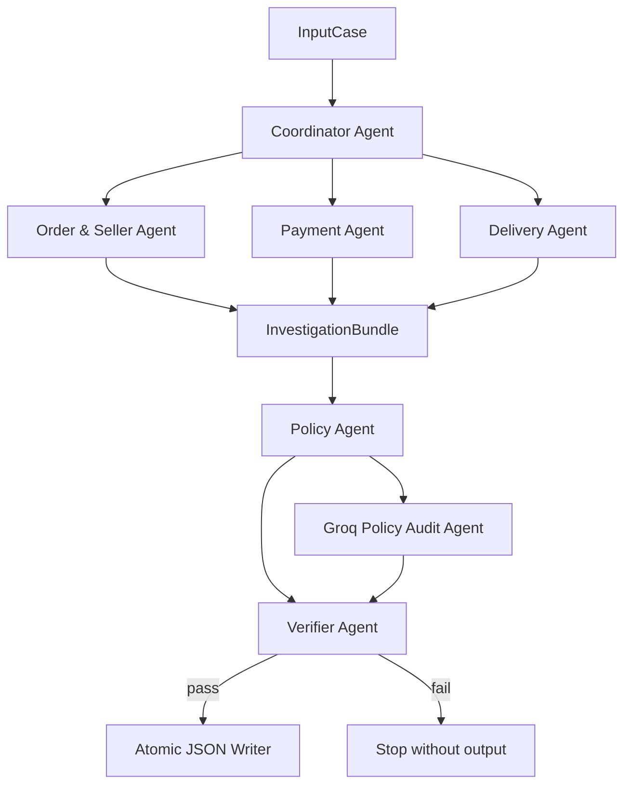

# Multi-Agent Architecture — Olist Dispute Resolution

## Design goals

The system resolves any valid `EC_POLICY_V1` input by joining the Olist snapshot and evaluating versioned business rules. No case ID, order ID, or expected answer is hard-coded. Numeric facts, evidence IDs, policy priority, and final verification are deterministic; the LLM is a non-authoritative reviewer only.

## Agent graph

## Roles and access

| Agent | Input contract | Access | Output contract |
|---|---|---|---|
| Coordinator | `InputCase` | Input filenames and case metadata | Typed handoffs |
| Order & Seller | `CaseContext` | Order, item, seller IDs and shipping limits | `OrderFacts` |
| Payment | `CaseContext` | Item prices, freight and payment rows | `PaymentFacts` |
| Delivery | `CaseContext` | Carrier, customer and estimated timestamps | `DeliveryFacts` |
| Policy | `InvestigationBundle` + context | Ordered `EC_POLICY_V1` rules | `Decision`, `CaseOutput` draft |
| Groq audit | Compact typed facts | No raw CSV, no secrets | Non-authoritative agreement JSON |
| Verifier | Draft + original context | Read-only facts and policy registry | Pass/fail with concrete errors |

## Handoff and trust model

The data repository reads relevant CSV files once and creates an immutable `CaseContext` for every order. Specialist agents cannot invent rows because they receive this context and return Pydantic contracts. The Policy Agent must consume the combined bundle. It evaluates rules in the documented priority order. The Verifier independently repeats policy evaluation, recalculates monetary fields, checks seller existence and verifies every evidence ID before the output is atomically written.

The audit model is `llama-3.1-8b-instant` (8B parameters). Its result is recorded in `logging/trace.jsonl`, but disagreement or provider failure cannot modify the deterministic resolution.

## Extensibility

- Input discovery accepts any number of JSON files; the submission validator separately enforces the official file set.
- A new policy version is added as a new ordered rule registry rather than branching on case IDs.
- Multiple items, payments and sellers are aggregated before policy evaluation.
- Entity and evidence collections are deterministically capped to the output limits.
- Unknown orders, malformed input, unsupported policy versions and unmatched cases fail explicitly instead of producing guessed evidence.

## Hidden-edge defenses

1. `valid_split_payment` precedes `unsupported_late_claim` when both match.
2. Paid unavailable orders remain resolvable when item rows are absent; item/freight totals and affected item/seller sets remain empty.
3. Multi-row totals use `Decimal`, evidence is built from real row identifiers, and caps are applied without dropping policy evidence.
